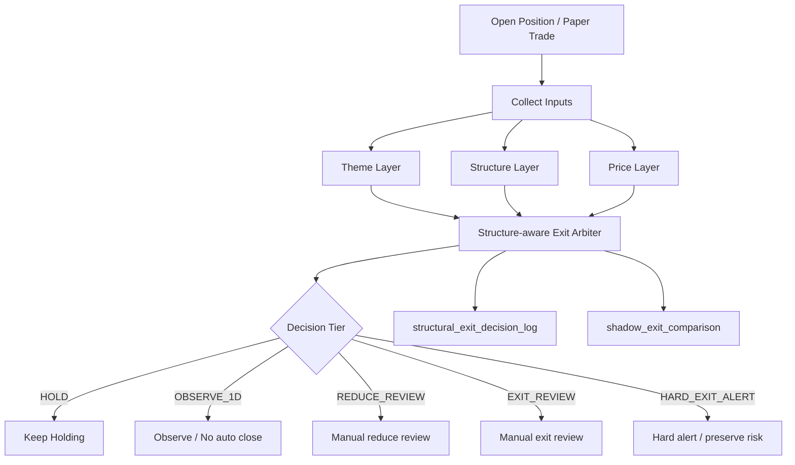

# Phase 1 — Structure-aware Exit Arbiter

日期：2026-06-02

狀態：Architecture / Shadow Mode Spec

範圍：持股出場決策，先以 shadow/manual-confirm 方式導入，不直接改真倉自動賣出。

---

## 1. 背景與目標

最近 post-upgrade 回測視窗為 `2026-05-19 ~ 2026-06-02`。回測摘要顯示：

| 指標 | 數值 |
|---|---:|
| Candidate Pool 勝率 | 61.80% |
| Final Include 勝率 | 67.27% |
| Candidate Pool 平均後續報酬 | 6.72% |
| Final Include 平均後續報酬 | 6.76% |
| Exit events | 10 |
| Exit 後 3~10 日內創高 | 9 |
| Stop Washout Rate | 90.0% |
| Stop 後平均後續漲幅 | 25.91% |

結論：選股品質與題材方向已有改善，但出場仍過度依賴 price trigger。Phase 1 的核心目標是：

```text
舊世代：price trigger system
新世代：structure-aware exit system
核心語義：EXIT 是結構事件，不只是價格事件。
```

### Phase 1 Success Criteria

| KPI | 現況 | Phase 1 目標 | 不可犧牲條件 |
|---|---:|---:|---|
| Stop Washout Rate | 90% | < 50% | 不放寬 hard risk stop |
| Price-only EXIT 佔比 | 高 | 明顯下降 | 僅降級為 review/observe，不自動忽略風險 |
| HARD_EXIT_ALERT 漏報 | 不可接受 | 0 | 結構破壞 + 量/RS/籌碼轉弱仍要強制警示 |
| Auto sell 風險 | paper-only | 維持 paper-only/manual-confirm | Phase 1 不開真倉自動賣出 |

---

## 2. Current Exit False Exit Analysis

### 2.1 Dynamic Stop / Stop Loss

現況來源：

- `PositionDecisionEngine.evaluate()`
- `effectiveStopLoss()` 取 `trailingStopPrice.max(stopLossPrice)`
- 若 `currentPrice <= effectiveStop`，大多直接走 `EXIT`，其中 trailing 有初步 structure guard。

問題：

1. Dynamic stop 本質仍是單一價格線。
2. 當個股屬於主流題材、RS 仍強、MA10/MA20 未破時，盤中跌破 stop 很可能只是洗盤。
3. `PositionReviewService` 目前 live quote v1 用 dayHigh 近似 sessionHigh，且若結構/題材資料缺口，容易讓 price stop 變成唯一可用訊號。

False Exit 來源：

```text
currentPrice <= effectiveStop
但：
- trend structure 未壞
- theme stage 未 decay
- relative strength 仍 outperforms benchmark
- volume 不是 breakdown
=> 應降級為 OBSERVE_1D / REDUCE_REVIEW，而不是 EXIT。
```

### 2.2 Trailing Stop

現況來源：

- `PositionDecisionEngine.computeTrailingAction()`：獲利達 5/10/20/30% 上移停損。
- `hasTrailingExitStructureBreak()` 已有初步結構確認：market C、failed breakout、volume spike long black、belowMa5+weak volume/momentum。

已改善處：

- `position.review.trailing_stop_requires_structure=true` 時，跌破 trailing stop 但未確認結構破壞會改為 `WEAKEN`。

仍有缺口：

1. trailing stop 只在 PositionDecisionEngine 內做局部判斷，尚未整合 Theme Layer。
2. `belowMa5`、`volumeSpikeLongBlack` 等欄位在 `PositionReviewService.evaluatePosition()` 目前大多是簡化/false，導致結構判斷不完整。
3. `WEAKEN` 不是正式的 Arbiter decision，後續 alert/auto-close/aftermarket review 無法一致地解讀它是「洗盤容忍」還是「出場前警戒」。

False Exit 來源：

```text
獲利後 trailing stop 上移過快
+ 強勢股盤中回測 MA5/MA10
+ 題材仍在主升段
=> price stop 被觸發，但後續 3~10 日創新高。
```

### 2.3 Position Review Exit

現況來源：

- `PositionReviewService.reviewAllOpenPositions()`
- `maybeSendExitAlert()`：decision = EXIT 時發 LINE。
- `maybeAutoClosePosition()`：decision = EXIT 時 paper-only mirror，自動真倉由 flag 控制。
- `ExitRegimeIntegrationEngine.applyOverride()` 可因 market/theme decay override。

風險：

1. Position Review 是決策出口，若上游 price-only EXIT 進來，會直接被 alert/paper close 接走。
2. `maybeSendExitAlert()` 的文字仍以 `review = EXIT` 表達，對人工決策有強暗示。
3. Phase 1 需要讓 Position Review 接受 Structural Arbiter 的 tier，而不是把所有 EXIT 都視為同一種嚴重度。

False Exit 來源：

```text
PositionDecisionEngine EXIT
=> PositionReviewService alert / paper close
但該 EXIT 未經 Theme + Structure 共識確認。
```

### 2.4 Price Gate Exit

現況來源：

- Entry / final decision 端有 `PriceGateDecision`、entry zone、stop loss / take profit plan。
- Exit 端目前沒有獨立的 Price Gate Layer schema；多半透過 stop/trailing/take-profit 的 price rule 間接實現。

問題：

1. Entry price gate 的「不追價」與 Exit price gate 的「跌破關鍵價」語義不同，不能混用。
2. 出場 Price Gate 若缺少結構確認，會把 intraday noise 當成 exit event。
3. 缺少 `price_gate_triggered_but_structure_intact` 的 shadow 留痕。

False Exit 來源：

```text
跌破動態停損 / trailing stop / MA5
但：MA10/MA20、前低、題材與 RS 沒壞
=> 應視為 price alert，而非 EXIT。
```

---

## 3. Architecture Spec

### 3.1 三層決策模型



### 3.2 Layer Responsibility

#### Theme Layer

判斷「主流題材是否仍支持持有」。

Inputs：

- `theme_strength_decision.theme_stage`
- `theme_lifecycle_state`
- `theme_leadership_snapshot`
- 是否屬於最近 30 天強勢題材
- theme rank / theme score
- market regime

Output：

| Theme State | 語義 |
|---|---|
| `MAINSTREAM_EXPANDING` | 主流題材擴散，容忍洗盤 |
| `MAINSTREAM_STABLE` | 主流仍在，但需結構確認 |
| `COOLING` | 題材降溫，降低容忍度 |
| `DECAY` | 題材失效，允許 exit review |
| `UNKNOWN` | 資料缺口，不得單獨 HOLD，也不得偽裝成 EXIT |

#### Structure Layer

判斷「趨勢結構是否真的被破壞」。

Inputs：

- MA5 / MA10 / MA20
- previous low
- recent high
- ATR
- volume ratio
- 5D/10D relative strength vs benchmark
- chip status
- long black / failed breakout / volume breakdown

Output：

| Structure State | 語義 |
|---|---|
| `INTACT` | MA10/MA20/前低未破，RS 不弱 |
| `SOFT_BREAK` | 破 MA5 或短線轉弱，但主結構未壞 |
| `TESTING_MA10` | 回測 10 日線，可觀察 1 日 |
| `TESTING_MA20` | 回測月線，需 theme 支持才容忍 |
| `BROKEN` | MA10/MA20/前低破壞且量/RS/籌碼轉弱 |
| `PANIC_BREAK` | 結構、量、RS 同時崩壞 |
| `DATA_GAP` | 技術資料不足 |

#### Price Layer

判斷「價格觸發了哪些風險事件」。

Inputs：

- hard stop loss
- trailing stop
- dynamic stop / effective stop
- MA5/MA10/previous low/ATR/hybrid shadow stops
- current price / day low / close
- PnL / MFE / MAE / drawdown from high

Output：

| Price Trigger | 語義 |
|---|---|
| `NO_TRIGGER` | 無價格風險 |
| `MA5_BREAK` | 短線警戒，不等於 EXIT |
| `TRAILING_STOP_TOUCH` | 移動停利觸發，需結構確認 |
| `DYNAMIC_STOP_TOUCH` | 動態停損觸發，需檢查 hard risk |
| `HARD_STOP_BREACH` | 原始風控停損，不可降級為 HOLD |
| `ATR_PANIC_BREACH` | 極端波動破壞，允許 hard alert |

### 3.3 Arbiter Decision Matrix

| Price Layer | Structure Layer | Theme Layer | Decision | 風控語義 |
|---|---|---|---|---|
| `HARD_STOP_BREACH` | any | any | `HARD_EXIT_ALERT` | 不降低硬停損風控 |
| `ATR_PANIC_BREACH` | `PANIC_BREAK` | any | `HARD_EXIT_ALERT` | 系統性崩壞 |
| `TRAILING_STOP_TOUCH` | `INTACT` | `MAINSTREAM_EXPANDING/STABLE` | `OBSERVE_1D` | 洗盤容忍 |
| `DYNAMIC_STOP_TOUCH` | `INTACT` | `MAINSTREAM_EXPANDING` | `OBSERVE_1D` | 價格破但結構未破 |
| `MA5_BREAK` | `SOFT_BREAK` | `MAINSTREAM_EXPANDING/STABLE` | `OBSERVE_1D` | 回測 5MA/10MA |
| `TRAILING_STOP_TOUCH` | `TESTING_MA10` | `MAINSTREAM_EXPANDING/STABLE` | `OBSERVE_1D` | 主流股回測 10MA |
| `TRAILING_STOP_TOUCH` | `TESTING_MA20` | `MAINSTREAM_EXPANDING` | `REDUCE_REVIEW` | 月線防守，人工確認 |
| any price trigger | `BROKEN` | `COOLING/DECAY` | `EXIT_REVIEW` | 價格與結構/題材共振轉弱 |
| any price trigger | `PANIC_BREAK` | any | `HARD_EXIT_ALERT` | 強制風險警示 |
| `NO_TRIGGER` | `BROKEN` | `DECAY` | `EXIT_REVIEW` | 題材/結構先壞，價格未必先到 |
| data gap | any | any | `DATA_GAP` | 不做自動 EXIT，要求補資料 |

### 3.4 不降低風控的硬規則

1. 原始 hard stop loss breach 不得被 Theme Layer 覆蓋成 HOLD。
2. `PANIC_BREAK` 不得被「主流題材」覆蓋。
3. `DATA_GAP` 不得偽裝成 HOLD；只能 `DATA_GAP` 或 `manual review`。
4. Phase 1 不啟用真倉自動賣出；`autoSellEnabled=false`。
5. `manualConfirmRequired=true` 固定保留。
6. `OBSERVE_1D` 最多容忍 1 個交易日；若隔日仍低於 stop 且結構轉弱，升級 `EXIT_REVIEW`。

---

## 4. DB Schema Change

### 4.1 新增 `structural_exit_decision_log`

```sql
CREATE TABLE structural_exit_decision_log (
    id BIGINT AUTO_INCREMENT PRIMARY KEY,
    trade_ref_type VARCHAR(20) NOT NULL,
    trade_ref_id BIGINT NOT NULL,
    symbol VARCHAR(20) NOT NULL,
    evaluated_at DATETIME NOT NULL DEFAULT CURRENT_TIMESTAMP,
    evaluation_date DATE NULL,

    mode VARCHAR(20) NOT NULL DEFAULT 'SHADOW',
    source_decision_status VARCHAR(40) NULL,
    source_exit_reason VARCHAR(255) NULL,

    arbiter_tier VARCHAR(40) NOT NULL,
    arbiter_reason VARCHAR(512) NULL,
    manual_confirm_required BOOLEAN NOT NULL DEFAULT TRUE,
    auto_sell_enabled BOOLEAN NOT NULL DEFAULT FALSE,

    theme_state VARCHAR(40) NULL,
    theme_stage VARCHAR(40) NULL,
    theme_rank INT NULL,
    theme_score DECIMAL(8,4) NULL,
    mainstream_theme BOOLEAN NULL,

    structure_state VARCHAR(40) NULL,
    health_score INT NULL,
    structure_status VARCHAR(60) NULL,
    volume_status VARCHAR(60) NULL,
    relative_strength_status VARCHAR(60) NULL,
    chip_status VARCHAR(60) NULL,

    price_state VARCHAR(40) NULL,
    current_price DECIMAL(12,4) NULL,
    entry_price DECIMAL(12,4) NULL,
    hard_stop_price DECIMAL(12,4) NULL,
    trailing_stop_price DECIMAL(12,4) NULL,
    dynamic_stop_price DECIMAL(12,4) NULL,
    ma5 DECIMAL(12,4) NULL,
    ma10 DECIMAL(12,4) NULL,
    ma20 DECIMAL(12,4) NULL,
    previous_low DECIMAL(12,4) NULL,
    atr DECIMAL(12,4) NULL,

    price_trigger_json JSON NULL,
    layer_votes_json JSON NULL,
    data_gaps_json JSON NULL,
    audit_tags_json JSON NULL,

    INDEX idx_struct_exit_ref (trade_ref_type, trade_ref_id),
    INDEX idx_struct_exit_symbol_date (symbol, evaluation_date),
    INDEX idx_struct_exit_tier_date (arbiter_tier, evaluated_at)
);
```

### 4.2 擴充 `shadow_exit_comparison`

Phase 1 可選擇不破壞既有表，新增欄位記錄 Arbiter 結果：

```sql
ALTER TABLE shadow_exit_comparison
    ADD COLUMN structural_arbiter_tier VARCHAR(40) NULL AFTER hybrid_price,
    ADD COLUMN structural_arbiter_reason VARCHAR(512) NULL AFTER structural_arbiter_tier,
    ADD COLUMN theme_state VARCHAR(40) NULL AFTER structural_arbiter_reason,
    ADD COLUMN structure_state VARCHAR(40) NULL AFTER theme_state,
    ADD COLUMN price_state VARCHAR(40) NULL AFTER structure_state,
    ADD COLUMN layer_votes_json JSON NULL AFTER price_state;
```

### 4.3 新增 `stop_washout_outcome`

用來做 3~10 日後驗證，不靠人工回推：

```sql
CREATE TABLE stop_washout_outcome (
    id BIGINT AUTO_INCREMENT PRIMARY KEY,
    structural_exit_log_id BIGINT NOT NULL,
    symbol VARCHAR(20) NOT NULL,
    exit_signal_at DATETIME NOT NULL,
    signal_tier VARCHAR(40) NOT NULL,
    signal_price DECIMAL(12,4) NULL,

    high_3d DECIMAL(12,4) NULL,
    high_5d DECIMAL(12,4) NULL,
    high_10d DECIMAL(12,4) NULL,
    new_high_3_10d BOOLEAN NULL,
    post_return_pct DECIMAL(10,4) NULL,
    washout_class VARCHAR(40) NULL,

    evaluated_at DATETIME NOT NULL DEFAULT CURRENT_TIMESTAMP,
    INDEX idx_washout_symbol_signal (symbol, exit_signal_at),
    INDEX idx_washout_class (washout_class)
);
```

---

## 5. Java Class Design

### 5.1 Core Types

```java
public enum ExitArbiterTier {
    HOLD,
    OBSERVE_1D,
    REDUCE_REVIEW,
    EXIT_REVIEW,
    HARD_EXIT_ALERT,
    DATA_GAP
}

public enum ThemeExitState {
    MAINSTREAM_EXPANDING,
    MAINSTREAM_STABLE,
    COOLING,
    DECAY,
    UNKNOWN
}

public enum StructureExitState {
    INTACT,
    SOFT_BREAK,
    TESTING_MA10,
    TESTING_MA20,
    BROKEN,
    PANIC_BREAK,
    DATA_GAP
}

public enum PriceExitState {
    NO_TRIGGER,
    MA5_BREAK,
    TRAILING_STOP_TOUCH,
    DYNAMIC_STOP_TOUCH,
    HARD_STOP_BREACH,
    ATR_PANIC_BREACH,
    DATA_GAP
}
```

### 5.2 Input / Output

```java
public record ExitArbiterInput(
    String symbol,
    String tradeRefType,
    Long tradeRefId,
    BigDecimal entryPrice,
    BigDecimal currentPrice,
    BigDecimal hardStopPrice,
    BigDecimal trailingStopPrice,
    BigDecimal dynamicStopPrice,
    BigDecimal ma5,
    BigDecimal ma10,
    BigDecimal ma20,
    BigDecimal previousLow,
    BigDecimal atr,
    BigDecimal volumeRatio,
    BigDecimal return5d,
    BigDecimal benchmarkReturn5d,
    BigDecimal return10d,
    BigDecimal benchmarkReturn10d,
    Integer healthScore,
    String structureStatus,
    String volumeStatus,
    String relativeStrengthStatus,
    String chipStatus,
    String themeStage,
    Integer themeRank,
    BigDecimal themeScore,
    Boolean mainstreamTheme,
    PositionDecisionResult sourceDecision
) {}

public record ExitArbiterResult(
    ExitArbiterTier tier,
    String reason,
    ThemeExitState themeState,
    StructureExitState structureState,
    PriceExitState priceState,
    boolean manualConfirmRequired,
    boolean autoSellEnabled,
    List<String> signals,
    List<String> dataGaps,
    Map<String, Object> layerVotes
) {}
```

### 5.3 Classes

| Class | Responsibility |
|---|---|
| `ThemeExitLayer` | 將 theme stage/rank/score/mainstream 轉成 ThemeExitState |
| `StructureExitLayer` | 將 MA/前低/RS/量/籌碼/health 轉成 StructureExitState |
| `PriceExitLayer` | 將 stop/trailing/MA/ATR price trigger 轉成 PriceExitState |
| `StructureAwareExitArbiter` | 合併三層結果，輸出 ExitArbiterResult |
| `StructuralExitDecisionLogService` | 寫入 `structural_exit_decision_log` |
| `StopWashoutOutcomeJob` | 對 3/5/10 日後結果做 washout 後驗證 |
| `StructuralExitShadowBacktestService` | 對歷史 review/paper trade replay Arbiter |

### 5.4 現有類別整合

| Existing Class | Phase 1 Change |
|---|---|
| `PositionDecisionEngine` | 保留原始 decision，作為 `sourceDecision`，不直接刪除規則 |
| `StructuralExitEngine` | 升級/替換為 `StructureAwareExitArbiter`，補 Theme/Price layer 與完整 input |
| `PositionReviewService` | 在 `writeShadowDiagnosis()` 後或前呼叫 Arbiter，寫 log；Phase 1 不改 maybeAutoClose 行為 |
| `ShadowExitRuleEngine` | 保留 MA/ATR/Hybrid price-only 對照，用來計算 baseline |
| `PortfolioHealthV2Service` / `PositionHealthEngine` | 提供 structure/health inputs |
| `ThemeStrengthService` | 提供 theme stage / score inputs |

---

## 6. Runtime Flow

### 6.1 Shadow Runtime

```text
reviewAllOpenPositions
  -> load live quote
  -> PositionDecisionEngine.evaluate()              // existing source decision
  -> ExitRegimeIntegrationEngine.applyOverride()    // existing market/theme override
  -> DailyTechnicalService.snapshot()
  -> PositionHealthEngine.evaluate()
  -> ShadowExitRuleEngine.evaluate()                // existing price baseline
  -> StructureAwareExitArbiter.evaluate()           // NEW shadow arbiter
  -> save position_review_log                       // existing
  -> save position_health_log                       // existing
  -> save shadow_exit_comparison                    // existing + arbiter columns
  -> save structural_exit_decision_log              // NEW
  -> maybeSendExitAlert / maybeAutoClosePosition    // unchanged in Phase 1
```

### 6.2 Manual-confirm Runtime（Phase 1.5 才可啟用）

當 shadow KPI 達標後，才把使用者可見文字從 source `EXIT` 改成 Arbiter tier：

| Arbiter Tier | User-facing Wording |
|---|---|
| `HOLD` | 結構仍完整，續抱 |
| `OBSERVE_1D` | 價格觸發但結構/題材未壞，觀察一日 |
| `REDUCE_REVIEW` | 建議人工檢查是否減碼 |
| `EXIT_REVIEW` | 建議人工確認出場 |
| `HARD_EXIT_ALERT` | 硬風險警示，請立即處理 |
| `DATA_GAP` | 資料不足，不做自動出場判斷 |

---

## 7. Shadow Mode Plan

### 7.1 Duration

至少 10 個交易日，且覆蓋：

- 盤中 review
- postmarket review
- 大盤轉弱日
- 主流題材回測日
- 至少 10 筆 source price exit / trailing touch event

### 7.2 Shadow Metrics

每日產出：

| Metric | Definition |
|---|---|
| `source_exit_count` | 原始 PositionDecisionEngine/FixedRule 產生 EXIT 數 |
| `arbiter_hard_exit_count` | Arbiter = HARD_EXIT_ALERT 數 |
| `arbiter_exit_review_count` | Arbiter = EXIT_REVIEW 數 |
| `downgraded_to_observe_count` | source EXIT 但 Arbiter = OBSERVE_1D |
| `downgraded_to_reduce_count` | source EXIT 但 Arbiter = REDUCE_REVIEW |
| `hard_risk_preserved_count` | hard stop breach 仍維持 HARD_EXIT_ALERT |
| `new_high_3_10d_after_source_exit` | source exit 後 3~10 日創高 |
| `new_high_3_10d_after_arbiter_exit` | arbiter exit/review 後 3~10 日創高 |
| `stop_washout_rate_source` | baseline washout rate |
| `stop_washout_rate_arbiter` | new washout rate |

### 7.3 Shadow Acceptance Gate

進入 Phase 1.5 前需滿足：

1. `stop_washout_rate_arbiter < 50%`。
2. `hard_risk_preserved_count == hard_stop_breach_count`。
3. `HARD_EXIT_ALERT` 沒有 false downgrade。
4. `DATA_GAP` 比例 < 20%；若超過，先補資料，不上線。
5. 人工抽樣 `OBSERVE_1D` 案例，至少 70% 被判定為合理洗盤容忍。

---

## 8. Rollout Plan

### Phase 1.0 — Schema + Shadow Logging

- 新增 DB migration。
- 新增三層 layer / arbiter class。
- `PositionReviewService` 只寫 log，不改 source decision。
- `autoSellEnabled=false` 固定。
- `manualConfirmRequired=true` 固定。

### Phase 1.1 — Backtest Replay

- 用 `position_review_log`、`paper_trade_exit_log`、`shadow_exit_comparison` replay 最近 2~4 週。
- 對每筆 source EXIT 計算 Arbiter tier。
- 建立 `stop_washout_outcome`。
- 驗證 90% washout 是否降到 < 50%。

### Phase 1.2 — Notification Wording Shadow

- 不改真倉，不改 paper close。
- Telegram / UI 額外附上 arbiter tier：

```text
原始訊號：EXIT / TRAILING_STOP_TOUCH
結構仲裁：OBSERVE_1D
原因：price broken but structure/theme intact
動作：人工觀察，不自動賣出
```

### Phase 1.5 — Manual-confirm Arbiter

- `maybeSendExitAlert()` 的 user-facing wording 改用 Arbiter tier。
- `maybeAutoClosePosition()` 只接受 `HARD_EXIT_ALERT` 或明確人工確認的 `EXIT_REVIEW`。
- `OBSERVE_1D`、`REDUCE_REVIEW` 不得觸發 paper/real auto-close。

### Phase 2 — Production Decision Integration

- Arbiter 成為正式 exit decision source。
- `PositionDecisionEngine` 改為 Price Layer provider，不再直接擁有最終 EXIT 權限。
- 真倉自動賣出仍需獨立 rollout review。

---

## 9. Backtest Validation Plan

### 9.1 Dataset

Replay 視窗：

- 最少：最近 2 週，即 `2026-05-19 ~ 2026-06-02`。
- 建議：最近 4 週，往前補足足夠 exit events。

資料來源：

- `position_review_log`
- `paper_trade`
- `paper_trade_exit_log`
- `shadow_exit_comparison`
- `position_health_log`
- `theme_strength_decision`
- `theme_lifecycle_state`
- TWSE daily OHLC

### 9.2 Replay Logic

對每筆 source exit event：

1. 取 exit signal 當日價格、stop、MA、ATR、theme、health。
2. 用舊規則記錄 baseline decision。
3. 用 Structure-aware Exit Arbiter 重算 decision。
4. 取後續 3/5/10 個交易日最高價。
5. 若後續創新高或 post return > 0，判斷是否 washout。
6. 比較 source vs arbiter 的 washout rate、平均錯失漲幅、最大保留虧損。

### 9.3 Required Output

| Report | Content |
|---|---|
| `source_exit_baseline.tsv` | 舊規則每筆 exit / stop / trailing 結果 |
| `structural_exit_replay.tsv` | Arbiter replay 結果 |
| `washout_outcome.tsv` | 3/5/10 日後驗證 |
| `risk_preservation.tsv` | hard risk 是否被保留 |
| `phase1_acceptance_summary.json` | KPI summary |

### 9.4 Acceptance Thresholds

| Metric | Pass Criteria |
|---|---:|
| Arbiter Stop Washout Rate | < 50% |
| Hard stop preserved | 100% |
| Average post-exit missed return | 較 baseline 降低至少 30% |
| Max extra loss from OBSERVE_1D | 不可超過原 hard stop 風險上限 |
| DATA_GAP rate | < 20% |

---

## 10. Implementation Priorities

### P0 — Build Shadow Arbiter and Audit Ledger

預估改善：可先辨識 60~80% price-only false exit，不動真倉。

交付：

- DB migration
- `ThemeExitLayer`
- `StructureExitLayer`
- `PriceExitLayer`
- `StructureAwareExitArbiter`
- `structural_exit_decision_log`
- replay report

### P1 — Notification / Manual-confirm Integration

預估改善：降低人工被 `EXIT` 字眼誤導造成的賣飛；對實際 washout rate 影響最大。

交付：

- Telegram/UI 顯示 Arbiter tier
- `OBSERVE_1D` 不再表述為 EXIT
- `EXIT_REVIEW` / `HARD_EXIT_ALERT` 分級
- pending exit API 加上 structural tier

### P2 — Replay/Learn Loop

預估改善：把 washout 案例回寫成 rule tuning dataset，避免每次靠人工診斷。

交付：

- `StopWashoutOutcomeJob`
- after-market replay dashboard
- 每週 washout KPI
- 自動建議 threshold 調整，但不自動改策略

---

## 11. Top Test Cases

1. Price below trailing stop, health score >= 70, MA10/MA20 未破，mainstream theme=true → `OBSERVE_1D`。
2. Price below hard stop loss → `HARD_EXIT_ALERT`，不可被 theme 覆蓋。
3. MA5 break + theme expanding + RS outperform → `OBSERVE_1D`。
4. MA10 break + volume breakdown + RS underperform + theme decay → `EXIT_REVIEW`。
5. MA20 / previous low break + health < 25 + volume breakdown + RS weak → `HARD_EXIT_ALERT`。
6. Data gap on technicals + source EXIT → `DATA_GAP` or `EXIT_REVIEW`，不得 HOLD。
7. Source EXIT downgraded to OBSERVE_1D，隔日結構轉弱 → 升級 `EXIT_REVIEW`。
8. Source EXIT downgraded to OBSERVE_1D，3~10 日創新高 → 標記 washout avoided。

---

## 12. Key Design Principle

```text
Price can trigger review.
Structure decides whether the trend is broken.
Theme decides whether washout tolerance is allowed.
Risk rules decide whether override is forbidden.
```

Phase 1 不是放寬停損，而是把「價格觸發」與「真正出場」拆開：

- price-only → review / observe
- structure + theme broken → exit review
- hard risk broken → hard alert

因此可在不降低風控的前提下，把 Stop Washout Rate 從 90% 壓到 50% 以下。
