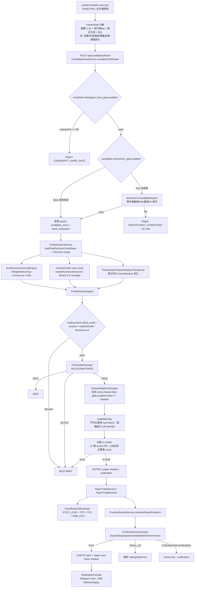

# AI 台股交易系統策略診斷 / 回測分析報告

日期：2026-05-14
範圍：/mnt/d/ai/stock/trading-system（唯讀診斷；未改 production decision path）
資料來源：本地 Java 服務 http://127.0.0.1:8888 的 GET API、repo 程式碼、score_config、paper trade full-trace、通知紀錄。
注意：DB 連線設定存在於 application.yml，但報告不列出密碼；所有建議皆以 shadow / backtest / alert 分級為主，不直接觸發 BUY。

---

## 1. Executive Summary

### 最近小賠最可能的 3 個主因

1. 進場與候選品質偏「當日強勢漲幅/成交額排序」，但買點與風報比沒有被嚴格守住。
   - market-breadth-scan.ps1 的候選分數主要由漲幅、成交金額、接近日高、收高於開盤組成，屬於強勢榜掃描，不等於可交易買點。
   - 最近 paper trade 12 筆全是 B 試單，且多筆 entry_rr_ratio 低於 1，甚至為負：2303 id=12 rr=-0.125、2303 id=11 rr=-0.047、6770 id=7 rr=-0.124、8926 id=9 rr=0.529、5388 id=10 rr=0.817。
   - FinalDecisionEngine 目前只有 A+ 要求 RR >= rr_min_ap；A/B 分桶只看 finalRankScore，導致低 RR/負 RR 仍可進 B 試單。

2. 出場與 paper trade 訊號存在「目標價/停利價低於或接近進場價」的資料品質問題，讓 TP1_HIT 不代表真正獲利。
   - paper trade closed 12 筆中，TP1_HIT 有 7 筆，但其中至少 3 筆 PnL 為負或接近 0：2303 id=12 TP1_HIT -0.1998%、2303 id=11 TP1_HIT -0.6831%、2344 id=2 TP1_HIT -0.1998%。
   - id=12：entry=104.5、target1=102.6，target1 低於 entry；id=11：entry=103.25、target1=102.6，target1 低於 entry；id=7：entry=63.9、target1=62.75，target1 低於 entry。
   - FixedRuleExitEvaluator 只判斷 bar.high >= target1 即 TARGET_1，沒有檢查 target1 是否高於 entry，因此資料錯會變成「負報酬停利」。

3. 持股監控仍偏單點 stop / trailing stop，技術結構輸入大量 placeholder，容易把正常回測視為 EXIT 或無法辨識健康整理。
   - PositionReviewService.evaluatePosition 目前把 marketGrade 固定為 B、themeRank/finalThemeScore 為 null、volumeWeakening=false、failedBreakout=false、nearResistance=false、madeNewHighRecently=false，sessionHigh 用 dayHigh 近似。
   - PositionDecisionEngine 的第一優先是 effectiveStop（trailingStopPrice 與 stopLossPrice 取 max）被 currentPrice 跌破就 EXIT；目前沒有 5MA/10MA/20MA、前低、量縮拉回、放量跌破、族群相對強弱確認。
   - 4739 目前 OPEN 但 reviewStatus=EXIT，reason=跌破移動停利 (stop=106.5800)；2303 / 00631L 通知也多次被 stop/trailing stop 判 EXIT，尚缺結構確認層。

### 最優先修正的 3 件事

P0-1：在 shadow mode 加「entry/target/stop sanity gate」與 RR gate，不讓 target1 <= entry、target2 <= target1、stop >= entry、RR < 門檻的資料進入 paper/decision ENTER path；先只記錄 shadow rejection，不改 BUY。

P0-2：新增 Position Health shadow evaluator，把 stop trigger 分成 SOFT_WARNING / REDUCE / EXIT_CONFIRM_REQUIRED；正式出場仍人工確認。至少補 MA5/10/20、前低、量能、族群強弱。

P0-3：補 backtest/forward tracking 的資料閉環：目前 /api/forward-tracking 回傳 total=0，paper_trade return_1d/3d/5d/10d 也多為 null，無法真正回答 1/3/5/10 日續抱結果。先用現有 paper_trade_exit_log / snapshots + 日線表或 TWSE 歷史資料補齊。

---

## 2. Current Flow Diagram

---

## 3. Current Flow / Gate / Scoring 盤點

### 3.1 Candidate 產生來源

主要來源：/mnt/d/ai/stock/market-breadth-scan.ps1 與 run-codex-v2-task.ps1。

market-breadth-scan.ps1 重點：
- 題材分類為規則式 keyword mapping，例如機器人、軍工、光電/面板、網通；未知歸「其他強勢股」。
- 分數：score = changePct * 1.25 + log10(amountYi+1)*3；nearHigh >= 0.99 加 3，>=0.97 加 1.5；收盤 > 開盤加 1；大波動但不近高扣 3；高價扣 2；非普通股扣 2。
- tradabilityTag：接近漲停/漲幅過大/高價會標示為「不列主進場」「僅參考」「可回測進場候選」。
- 這是強勢榜掃描，不是完整主流資金判斷；法人、投信、外資、族群擴散、新聞強度尚未成為分數核心。

Java CandidateScanService：
- /api/candidates/batch 接收候選。
- changePct hard gate 已開：candidate.changepct_hard_gate.enabled=true，max_pct=9.0。
- momentum gate 未開：candidate.momentum_gate.enabled=false。因此 MomentumCandidateEngine 目前不是真正 candidate hard gate。
- buildEngineInput 有 bootstrap fallback：volumeRatio 缺失但 amountYi >= 1 億時直接給 1.5；theme snapshot 找不到時 themeRank=99、finalThemeScore=5.0。此設計避免殺光候選，但也讓缺資料標的容易通過。

### 3.2 Theme / Momentum / Setup 評分流程

已存在但接入不完整：
- ThemeSnapshot / ThemeStrength / ThemeGateOrchestrator / ThemeShadowModeService / ThemeLiveDecisionService 皆存在，FinalDecisionService 有注入。
- 近期 final decision trace 常見 themeGateTrace.results=[]、summary.reason=no candidates，代表實際 trace 上 theme gate 沒有形成候選過濾或主流加權的穩定證據。
- MomentumCandidateEngine 存在，但 candidate.momentum_gate.enabled=false；因此「momentum observation mode」尚未正式管決策。

目前主流偵測問題：
- 最近候選大量 themeTag 為「其他強勢股」：2367、2363、1582、9958、2481、2316、6116、1216、1609、2458、8926 等。
- 這會造成主流族群與資金流向訊號被稀釋，因為「其他強勢股」不是可交易主題。
- 通知顯示主流族群為記憶體、PCB、半導體，但 2026-05-15 候選前四名皆為其他強勢股，與主流敘事 overlap 低。

### 3.3 FinalDecisionEngine 決策

關鍵邏輯：
- kill switch：trading.status.allow_trade=false 直接 REST。
- session gate：盤前/早盤特定 session 回 WAIT。
- marketGrade=C 直接 REST。
- decisionLock=LOCKED 直接 REST。
- 10:30 後且 market 非 A、無持倉時 REST。
- priceGate：BLOCK / WAIT / PASS。
- chased-high gate 已接入但 entry.chased-high-gate.enabled=false，目前只是 shadow log。
- tradabilityTag：不列主進場 hard block；漲幅過大/僅參考 soft penalty。
- 分桶：A+ / A / B / C。A+ 需 finalRankScore >= grade_ap_min 且 RR >= rr_min_ap；A、B 目前未要求 rr_min_grade_a / rr_min_grade_b，導致低 RR 也可能被選為 B trial。

Score config 現況：
- scoring.grade_ap_min=8.2、grade_a_min=7.5、grade_b_min=5.8。
- scoring.rr_min_ap=2.2、rr_min_grade_a=2.0、rr_min_grade_b=1.8，但 FinalDecisionEngine 分桶實作只看到 A+ 用 RR。
- scoring.java_weight=0.50、claude_weight=0.35、codex_weight=0.15。
- final_decision.ai_default_reweight.enabled=true；Claude/Codex default 3.0 會把權重轉給 Java，避免 default AI score 稀釋。

### 3.4 AI Claude / Codex 接入

- AiTaskController 支援 task create/claim/claude-result/codex-result/finalize。
- FinalDecisionService 會讀 StockEvaluation 的 claudeScore/codexScore/finalRankScore/isVetoed，並有 default 3.0 reweight。
- 通知顯示 AI task final 透過 TelegramTemplateService 格式化；NotificationFacade 對 AI final 使用 Telegram only，避免 raw Claude/Codex markdown leak 到 LINE。

問題：
- 多筆 final trace 顯示 Claude 分數高但 finalAction REST 或 PLAN，原因可能是 priceGate/portfolio full/買點不好。
- AI 研究結果更像敘事與風險輔助，尚未穩定回灌到 Theme/Momentum/Position health 的量化欄位。

### 3.5 持股追蹤與通知

PositionReviewService：
- 讀 OPEN positions，抓 live quote。
- quote 不可用時輸出 DATA_BLOCKED/QUOTE_STALE，不更新 trailing stop。
- evaluatePosition 建 PositionDecisionInput，但多個結構欄位目前是 placeholder：marketGrade="B"、themeRank/finalThemeScore=null、volumeWeakening=false、failedBreakout=false、nearResistance=false、madeNewHighRecently=false。
- EXIT 時送 LINE alert；auto_close.enabled=true 但 auto_close.paper_only=true，因此只做 paper shadow，不動真倉。

PositionDecisionEngine：
- 優先序：Momentum 快速出場（若 strategyType=MOMENTUM_CHASE）> effectiveStop 跌破 EXIT > 虧損超過上限 EXIT > 高點回撤 + 動能弱 EXIT/WEAKEN > failedBreakout 虧損 EXIT > extreme 延伸弱 EXIT > stale days EXIT > trailing stop 上移 > theme weak WEAKEN > strong/hold。
- effectiveStop = max(trailingStopPrice, currentStopLoss)。跌破即 EXIT，沒有 MA/前低/量能確認。

通知：
- NotificationLog 有 Telegram 與 LINE/legacy 紀錄。
- 最近 2026-05-14 MIDDAY 通知列 00631L、2303、4739 為 EXIT，原因多為跌破 stop/trailing stop 或獲利回吐。

---

## 4. Data Evidence：最近推薦 / 持股 / 出場案例

### 4.1 Position 實際/手動持倉紀錄

| 日期 | 股票 | 狀態 | 進場 | 出場 | Exit/Review | PnL | 問題類型 |
|---|---|---:|---:|---:|---|---:|---|
| 2026-05-14 | 3481 群創 | CLOSED | 37.2 | 36.2 | STOP_LOSS | -4000 | 追強後當日停損；候選分數高但隔日/當日價格轉弱 |
| 2026-05-13 | 4739 康普 | OPEN | 101.5 | - | review=EXIT，跌破移動停利 stop=106.58 | - | stop 單點觸發；缺 MA/前低/量能確認 |
| 2026-05-13 | 2481 強茂 | CLOSED | 116.0 | 119.0 | TAKE_PROFIT_1 | +3000 | 正向案例；但 review still STRONG，是否出太早需用 5MA/10MA 回測驗證 |
| 2026-05-12 | 2312 金寶 | CLOSED | 30.0 | 28.85 | STOP_LOSS | -2300 | 買點/選股疑慮；review 曾 HOLD，但後續停損 |
| 2026-05-06 | 6770 力積電 | CLOSED | 57.7 | 61.0 | TAKE_PROFIT_1；review=EXIT 跌破移動停利 stop=63.47 | +3300 | 盈利但 trailing stop 曾高於出場/回落；需檢查是否過度敏感 |
| 2026-04-28 | 8112 至上 | CLOSED | 87.8 | 85.5 | STOP_LOSS；review=EXIT stop=87.0 | -2300 | 停損偏近；缺結構確認 |
| 2026-04-21 | 2303 聯電 | CLOSED | 75.7 | 75.1 | STOP_LOSS；review=EXIT 跌破移動停利 stop=76.84 | -600 | 小賠典型；可能 trailing/stop 過緊 |

### 4.2 Paper trade closed 統計

樣本：12 筆 closed paper trades。

| 指標 | 數值 |
|---|---:|
| 總筆數 | 12 |
| 勝 / 敗 | 6 / 6 |
| 平均 pnlPct | +1.339% |
| pnlPct 合計 | +16.07% |
| TP1_HIT | 7 筆，平均 +3.254% |
| STOP_LOSS | 2 筆，平均 -4.841% |
| POSITION_REVIEW_EXIT | 1 筆，-5.901% |
| TIME_EXIT | 1 筆，+0.941% |
| TP2_HIT | 1 筆，+7.935% |

表面看 paper 是正，但資料品質有問題：TP1_HIT 包含負報酬，且多筆 RR 低/負。

### 4.3 Paper trade 逐筆問題分類

| id | 日期 | 股票 | finalRank | RR | entry | target1 | exit | reason | pnlPct | 問題類型 |
|---:|---|---|---:|---:|---:|---:|---:|---|---:|---|
| 12 | 2026-05-12 | 2303 聯電 | 7.26 | -0.125 | 104.5 | 102.6 | 104.5 | TP1_HIT | -0.1998 | target1 < entry；負 RR 仍進 shadow；TP1 名義錯誤 |
| 11 | 2026-05-12 | 2303 聯電 | 7.36 | -0.047 | 103.25 | 102.6 | 102.75 | TP1_HIT | -0.6831 | target1 < entry；出場理由誤導 |
| 10 | 2026-05-11 | 5388 中磊 | 6.11 | 0.817 | 86.55 | 91.91 | 79.4 | STOP_LOSS | -8.4445 | RR 低於應有門檻；停損幅度大於預期小賠 |
| 9 | 2026-05-11 | 8926 台汽電 | 6.07 | 0.529 | 50.65 | 53.03 | 54.85 | TP1_HIT | +7.8629 | RR 低但結果好；不可證明規則正確 |
| 8 | 2026-05-08 | 2303 聯電 | 6.50 | 1.114 | 97.1 | 104.22 | 91.6 | POSITION_REVIEW_EXIT | -5.9012 | Position review 出場；缺 5/10MA 續抱對照 |
| 7 | 2026-05-07 | 6770 力積電 | 6.19 | -0.124 | 63.9 | 62.75 | 65.35 | TP1_HIT | +2.0649 | target1 < entry，但 exit 價高；規則/資料不一致 |
| 6 | 2026-05-07 | 2356 英業達 | 6.35 | 3.687 | 47.72 | 53.14 | 50.45 | TIME_EXIT | +0.9407 | 時間出場；可測 5MA/10MA 是否更佳 |
| 5 | 2026-05-07 | 6770 力積電 | 6.24 | 3.651 | 56.36 | 62.75 | 63.9 | TP1_HIT | +9.763 | 正向案例 |
| 4 | 2026-05-06 | 2303 聯電 | 6.16 | 3.656 | 80.61 | 89.75 | 98.85 | TP2_HIT | +7.935 | 正向案例；仍需檢查是否太早停利 |
| 3 | 2026-05-06 | 2344 華邦電 | 6.26 | 3.657 | 95.84 | 106.7 | 113.25 | TP1_HIT | +4.1694 | 正向案例 |
| 2 | 2026-05-06 | 2344 華邦電 | 6.56 | 3.657 | 95.84 | 106.7 | 108.5 | TP1_HIT | -0.1998 | exit/entry/pnl 計算有不一致，需查 simulated entry/exit |
| 1 | 2026-04-28 | 8112 至上 | - | - | 87.8 | 88.5 | 86.8 | STOP_LOSS | -1.2378 | 小賠；停損近 |

### 4.4 最近候選與主流 overlap

2026-05-15 前五候選：2367 燿華（其他強勢股）、2363 矽統（其他強勢股）、1582 信錦（其他強勢股）、9958 世紀鋼（其他強勢股）、6770 力積電（半導體/IC）。

2026-05-14 前五候選：3481 群創（光電/面板）、2481 強茂（其他強勢股）、2316 楠梓電（其他強勢股）、6116 彩晶（其他強勢股）、2324 仁寶（AI伺服器/電腦週邊）。

通知主流族群：記憶體、PCB、半導體。

Overlap 結論：低到中。候選有半導體/PCB/記憶體，但排序前段經常被「其他強勢股」佔據。原因不是完全沒有主題，而是 theme mapping/主流權重不足，使非主流的當日強勢股能壓過主流題材中的較健康買點。

---

## 5. Backtest Result / 能力盤點

### 5.1 已存在能力

- BacktestController：/api/backtest/run、/api/backtest/runs、/api/backtest/runs/{id}/trades。
- BacktestService：從 closed PositionEntity 重建交易，計算 totalTrades、winCount、lossCount、winRate、avgReturn、avgHoldingDays、maxDrawdown、profitFactor、best/worst、totalPnl。
- FixedRuleExitEvaluator：Paper Trade 與 Backtest 可共用，規則為 STOP_LOSS > TARGET_2 > TARGET_1 > TIME_EXIT。
- PaperTradeEntity 已有 return_1d/3d/5d/10d 欄位與 entryGrade/entryRrRatio/entryRegime/entryPayloadJson。

### 5.2 目前不足

| 能力 | 現況 | 缺口 |
|---|---|---|
| candidate -> final decision -> simulated trade | 部分存在，paper.shadow.enabled=true | finalDecisionId 多筆為 null；trace 未完整連到 candidate/date/AI task |
| 1/3/5/10 日報酬 | Entity 有欄位，API response 未輸出；目前 full-trace return 多為 null | PaperTradeReturnBackfillJob 未成功填齊或資料源不足 |
| 不同 exit rule 對照 | 無 | 只有 fixed stop/tp/time；沒有 MA/前低/ATR/量價結構 shadow |
| win rate / avg win/loss / PF | BacktestMetricsEngine 存在 | 基於 Position closed，不是 candidate forward test；樣本少且混手動/測試 |
| setup vs momentum vs theme 分組 | Entity 有 strategyType/themeTag | 報表/查詢不足；近期全部多為 SETUP/B trial |
| 最大回撤 | paper 有 mfe/mae，但許多 null 或數值異常 | 需要 intraday/daily bar 完整化與計算一致性 |
| 續抱到 5MA/10MA/前低比較 | 無 | 需日線 OHLC/MA/volume 表與 shadow exit engine |

### 5.3 現有規則 vs 新規則初步比較

因目前缺少完整 daily OHLC/MA forward returns，本次不能嚴格給出 1/3/5/10 日量化結論；只能根據可得 paper/position 追蹤初判：

| 規則 | 現況可觀察結果 | 優點 | 缺點 / 風險 |
|---|---|---|---|
| trailing stop only | 4739、2303、00631L 多次因跌破移動停利 EXIT | 保護獲利、簡單 | 易被洗盤/回測均線掃出；缺結構確認 |
| trailing + 5MA confirmation | 尚未實作 | 避免單點假跌破 | 可能晚出，需搭配放量長黑 |
| trailing + previous low confirmation | 尚未實作 | 適合波段/Setup，看結構破壞 | 跌破前低才出場可能回吐較多 |
| ATR stop + structure confirmation | 尚未實作 | 適應不同波動度 | 需 ATR 日線與策略別參數 |
| 分批停利 + MA 確認 | 部分 TP1/TP2 有，但非分批真倉、資料異常 | 可降低全出太早 | target sanity 必須先修 |
| Momentum / Setup / Theme 分策略 | PositionDecisionEngine 有 MOMENTUM_CHASE 特例，但多數實際為 SETUP | 可依型態調整停損寬度 | strategyType 填值與 candidate 分類需更準 |

---

## 6. Root Cause Analysis

### 選股層

- 候選來源偏強勢榜公式：漲幅/成交額/近高 > 主流題材/法人/投信/族群擴散。
- 「其他強勢股」過多，代表 theme mapping 覆蓋不足或主流權重不夠。
- MomentumCandidateEngine 未啟用，很多 MA/量能/連漲/新高欄位在 payload 為 null。
- Theme engine 有類別但 trace 顯示常 no candidates，實際 gating/boost 不穩。

### 買點層

- FinalDecisionEngine 的 chased-high gate 仍 shadow，未阻擋追高。
- A/B 分桶未套 rr_min_grade_a / rr_min_grade_b，低 RR/負 RR 可進 shadow/paper。
- entryPriceZone / stopLoss / takeProfit 可能來自舊價或不一致資料，導致 target1 <= entry。

### 持股層

- PositionReviewService 的輸入仍簡化，缺 MA、前低、成交量、相對強弱、法人籌碼。
- sessionHigh 用 dayHigh 近似，不是持倉期間最高，drawdown/trailing 訊號可能失真。
- theme/rank 缺失時無法有效判斷題材退潮或族群同步性。

### 出場層

- effectiveStop 單點跌破即 EXIT，尚無「跌破 stop 但守 5MA/10MA = soft warning」的層級。
- FixedRuleExitEvaluator 沒有 target/entry sanity；TP1_HIT 可能是負報酬。
- Paper trade exit reason 與 pnl 計算存在 simulated/intended price 不一致，需要統一報表欄位。

### AI 評分層

- default AI score reweight 已修正稀釋問題，但 AI 分數仍未轉為可驗證的結構欄位。
- Claude 高分但買點不好時，FinalDecision 會 REST/PLAN；這是合理，但報表應拆成「標的 thesis 好」vs「買點不可追」。
- Codex/Claude 的主流題材判斷未穩定回灌 theme score / momentum score / position health。

### 市場 regime 層

- MarketGrade 常顯示 A，但通知 market phase 可能是震盪；REST 合規評分 100/100 不能解釋實際小賠。
- 需要把 regime 拆成「可進攻」與「只適合持股/低接」，不要只有 A/B/C。
- 近幾筆虧損集中在強勢股追高後回落，代表 regime 即使 A，也可能是輪動快、追價不利。

---

## 7. Improvement Proposal

### P0：馬上修，降低小賠

1. Shadow Sanity Gate（不改正式 BUY）：
   - 檢查 entry/stop/tp/RR：stop < entry < tp1 < tp2；RR >= 1.8；target1 至少 entry + 3%；stop 距 entry 不超過策略上限。
   - 若不通過：標記 SHADOW_REJECT_BAD_PRICE_PLAN，不建立 paper trade 或建立 VOID shadow，不影響正式決策。

2. FinalDecision RR gate shadow：
   - A/B 分桶也記錄 rr_min_grade_a / rr_min_grade_b 是否通過。
   - 先 shadow log：若 B 因 RR<1.8 被擋，追蹤後續是否真的少賠。

3. Exit alert 分級：
   - 現有 EXIT 不直接等同賣出建議，改通知 wording：EXIT_CONFIRM_REQUIRED / SOFT_WARNING / REDUCE_WATCH。
   - auto_close.paper_only 保持 true。

4. 修正 paper report DTO：
   - PaperTradeResponse 增加 simulatedEntryPrice、simulatedExitPrice、entryGrade、entryRrRatio、entryRegime、return1d/3d/5d/10d、shadow。
   - 避免 TP1_HIT 但 pnl 為負時看不出原因。

### P1：一週內做，改善選股與持股分析

1. PositionHealthEngine shadow：
   - 輸入：OHLCV daily bars、MA5/10/20、MA slope、prev swing low、ATR、volume ratio、market index return、theme peers return、institutional flow。
   - 輸出：healthScore、structureStatus、volumeStatus、relativeStrengthStatus、chipStatus、exitTier。

2. Theme/Mainstream Engine 實戰化：
   - 將主流題材與候選 overlap 做成每日報表。
   - 「其他強勢股」不得排名超過主流股，除非有成交額/法人/新聞/族群擴散支持。
   - 加入族群擴散：同 theme 漲幅>2%、成交額放大、創高家數。

3. Exit shadow rules 對照：
   - 現行 stop/trailing vs 5MA break vs 10MA break vs previous low break vs ATR stop vs long black volume spike。
   - 每筆 paper/position 都存 shadow_exit_result，不觸發真倉。

4. Backfill returns：
   - 每日補 return_1d/3d/5d/10d、MFE/MAE、若續抱至 MA5/10 的 exitDate/return。

### P2：後續做，讓系統更貼近主流資金

1. 法人/投信/外資 flow 加權：
   - T86 連買、投信續買、外資反手、法人集中度。

2. 主流新聞與 KOL/KolSignal 聚合：
   - 主題新聞熱度與族群同步性，不只 stock name keyword。

3. Regime-aware strategy selector：
   - 主升：Momentum 可放寬至 5MA/10MA；震盪：只允許回測低接；出貨：不新增。

4. Missed rally / rejected candidate tracking 真正啟用：
   - 目前 /api/missed-rallies 與 /api/forward-tracking 都是 0，無法知道 gate 是否太硬或錯失主流。

---

## 8. Position Health / Holding Analysis Engine 設計

### 新 Engine：PositionHealthEngine

輸入 DTO：PositionHealthInput
- symbol、strategyType、entryDate、entryPrice、currentPrice、holdingDays
- dailyBars: recent 30-60 bars（open/high/low/close/volume）
- ma5/ma10/ma20、ma5Slope/ma10Slope/ma20Slope
- previousLow、swingLow、atr14
- volumeRatio5、volumeRatio20、downVolumeSpike、upVolumeExpansion
- marketReturn5d/10d、stockReturn5d/10d、themeReturn5d/10d
- institutionalFlow: foreignNetBuyDays、trustNetBuyDays、dealerNetBuyDays、lastTurnSell
- themeStage: HEATING / MAIN_UP / ROTATION / COOLING / DEAD

輸出 DTO：PositionHealthResult
- healthScore 0-100
- structureStatus: BULL_STACK / ABOVE_MA5 / PULLBACK_TO_MA5 / BETWEEN_MA5_MA10 / BELOW_MA10 / BROKEN_PREV_LOW
- volumeStatus: HEALTHY_PULLBACK / UP_VOLUME / DOWN_VOLUME_SPIKE / VOLUME_DRY / NEUTRAL
- chipStatus: ACCUMULATING / MIXED / DISTRIBUTING / UNKNOWN
- relativeStrengthStatus: STRONG_VS_INDEX / WEAK_VS_INDEX / STRONG_VS_THEME / LAGGING_THEME
- exitTier: HOLD / SOFT_WARNING / REDUCE / EXIT_CONFIRM_REQUIRED / HARD_EXIT
- reasons[]
- shadowStops: currentStop、ma5Stop、ma10Stop、prevLowStop、atrStop、hybridStop

決策原則：
- hard stop：跌破前低 + 放量長黑 / 跌破 10MA 且 MA5 下彎 / 題材退潮 + 籌碼轉賣。
- soft warning：價格接近 stop 但仍守 MA5/10，或量縮拉回。
- hold：正常回測 5MA/10MA 且量縮，個股仍強於指數/族群。
- reduce：跌破 5MA 但未破 10MA/前低，或籌碼開始轉弱。
- exit：跌破前低、放量長黑、跌破 10MA 且主流退潮、外資/投信反手。

---

## 9. Implementation Spec

### 新增 Entity / Table

1. `position_health_log`
   - id, position_id, symbol, reviewed_at
   - current_price, ma5, ma10, ma20, prev_low, atr14
   - volume_ratio5, volume_ratio20
   - stock_return_5d, index_return_5d, theme_return_5d
   - structure_status, volume_status, chip_status, relative_strength_status
   - exit_tier, health_score, reasons_json
   - shadow_stops_json

2. `shadow_exit_comparison`
   - id, trade_ref_type(POSITION/PAPER), trade_ref_id, symbol, evaluated_at
   - current_rule_action, current_rule_exit_price
   - ma5_rule_action, ma10_rule_action, prev_low_rule_action, atr_rule_action, hybrid_rule_action
   - hypothetical_return_json

3. `candidate_forward_return`
   - candidate_date, symbol, entry_price, close_1d/3d/5d/10d, return_1d/3d/5d/10d
   - max_drawdown_5d/10d, max_favorable_5d/10d
   - selected_flag, final_decision_id, theme_tag, final_rank_score, rr, grade

### 新增 DTO

- PositionHealthInput / PositionHealthResult
- MovingAverageSnapshotDto
- VolumeHealthDto
- RelativeStrengthDto
- ShadowExitRuleResultDto
- CandidateForwardReturnDto
- PricePlanSanityResultDto

### 新增 Service / Engine

- PositionHealthEngine：pure function，計算健康狀態。
- PositionHealthService：讀 position + bars + T86 + theme，存 health log。
- ShadowExitRuleEngine：同時計算 MA5/MA10/prevLow/ATR/hybrid。
- PricePlanSanityEngine：檢查 entry/stop/tp/RR 的一致性。
- CandidateForwardReturnBackfillService：補候選 1/3/5/10 日報酬。
- MainstreamOverlapReportService：每日候選與主流族群 overlap。

### 既有 class 修改（shadow first）

- CandidateScanService：persist 前呼叫 PricePlanSanityEngine；先只寫 payload/sanity flag，不 hard block production。
- FinalDecisionEngine：A/B 分桶新增 RR shadow check；可加 config `final_decision.rr_gate.shadow_only=true`。
- PaperTradeResponse：輸出 simulated price、entryGrade、entryRrRatio、return fields、shadow。
- FixedRuleExitEvaluator：若 target1 <= entry 或 target2 <= entry，回傳 INVALID_PRICE_PLAN 或不觸發 TP；先在 paper shadow 修。
- PositionReviewService：在 evaluatePosition 前後呼叫 PositionHealthService；通知採 health exitTier，不直接覆蓋 current decision。
- Notification templates：把 EXIT 分級顯示為「需人工確認」並列 MA/前低/量能原因。
- BacktestService：新增 candidate-based backtest，不只 closed position replay。

### Config flags

- `price_plan.sanity.enabled=true`
- `price_plan.sanity.shadow_only=true`
- `price_plan.min_rr.setup=1.8`
- `price_plan.min_rr.momentum=2.0`
- `position.health.enabled=true`
- `position.health.shadow_only=true`
- `position.exit.structure_confirmation.enabled=false`（先 false）
- `position.exit.alert_tier.enabled=true`
- `final_decision.rr_gate.shadow_only=true`
- `final_decision.rr_gate.apply_to_b=false`
- `paper.exit.invalid_price_plan.block_tp=true`
- `backtest.shadow_exit.enabled=true`

### 測試案例清單

1. PricePlanSanityEngineTest
   - target1 <= entry => invalid
   - stop >= entry => invalid
   - RR < 1.8 => warning/block shadow
   - valid setup => pass

2. FinalDecisionEngineRrGateShadowTest
   - B score 6.5 but RR 0.8 => shadowReject reason，不影響 production when shadow_only=true
   - A score 7.8 but RR 1.2 => shadow warning
   - A+ score 8.5 RR 2.3 => pass

3. FixedRuleExitEvaluatorSanityTest
   - target1 < entry 不得 TARGET_1
   - same bar hit stop/tp still stop first

4. PositionHealthEngineTest
   - pullback to rising 5MA with low volume => HOLD
   - below 5MA but above 10MA => REDUCE/SOFT_WARNING
   - break previous low + volume spike => HARD_EXIT
   - above MA stack + strong relative return => STRONG/HOLD

5. PositionReviewServiceShadowTest
   - current stop hit but health HOLD => EXIT_CONFIRM_REQUIRED not auto real close
   - stale quote => DATA_BLOCKED and no trailing update

6. CandidateForwardReturnBackfillTest
   - candidate 1/3/5/10D returns fill correctly
   - missing daily bar produces data gap report

---

## 10. Claude / Codex 下一階段實作 Prompt

### Prompt A：P0 Sanity + RR shadow gate

請在 `/mnt/d/ai/stock/trading-system` 實作 P0 shadow-only 防小賠修正，不要改 production BUY 行為：

目標：
1. 新增 `PricePlanSanityEngine`，檢查 candidate/paper/final decision 的 entryPrice、stopLossPrice、takeProfit1、takeProfit2、riskRewardRatio。
2. 規則：`stop < entry < tp1 < tp2`、RR >= config 門檻、tp1 至少比 entry 高 3%、stop 距 entry 不超過策略允許範圍；任何 invalid 都要產生 `PricePlanSanityResult`，但在 `price_plan.sanity.shadow_only=true` 時不得阻擋 production decision。
3. FinalDecisionEngine 對 A/B bucket 加 RR shadow check：A 用 `scoring.rr_min_grade_a`，B 用 `scoring.rr_min_grade_b`；先只寫 rejectedReasons/trace，不改 ENTER。
4. PaperTradeResponse 增加 simulatedEntryPrice、simulatedExitPrice、entryGrade、entryRrRatio、entryRegime、return1d/3d/5d/10d、shadow。
5. FixedRuleExitEvaluator 增加 invalid target sanity：target1 <= entry 或 target2 <= entry 時不得觸發 TP；先用 config `paper.exit.invalid_price_plan.block_tp=true` 控制，預設 true。

限制：
- 不得關閉現有 scheduler。
- 不得讓新規則直接觸發 BUY。
- auto_close 仍保持 paper_only。
- 補單元測試：PricePlanSanityEngineTest、FinalDecisionEngineRrGateShadowTest、FixedRuleExitEvaluatorSanityTest。
- 執行 `./mvnw test` 或等價測試，回報結果與風險。

### Prompt B：Position Health shadow engine

請在 `/mnt/d/ai/stock/trading-system` 實作 Position Health shadow mode：

目標：
1. 新增 `PositionHealthEngine` pure function 與 DTO：PositionHealthInput、PositionHealthResult。
2. 評估現價 vs MA5/MA10/MA20、均線斜率、多頭排列、前低、ATR14、成交量 ratio、放量長黑、量縮拉回、個股 vs 加權指數/族群 5D/10D 強弱。
3. 輸出 `exitTier`: HOLD / SOFT_WARNING / REDUCE / EXIT_CONFIRM_REQUIRED / HARD_EXIT。
4. 新增 `position_health_log` Entity/Repository/Service，PositionReviewService 每次 review 後寫 shadow log，但不得覆蓋原 decision status。
5. 通知模板先只在 EXIT 訊號後附加 health summary，例如「跌破 stop 但仍守 10MA、量縮 => EXIT_CONFIRM_REQUIRED，人工確認」。
6. 加 config：`position.health.enabled=true`、`position.health.shadow_only=true`、`position.exit.structure_confirmation.enabled=false`。

限制：
- 不得改真倉出場。
- 不得自動賣出。
- 若日線/MA 資料不足，輸出 DATA_GAP，不得假裝 HOLD。
- 補測試：PositionHealthEngineTest、PositionReviewServiceShadowTest。

### Prompt C：Candidate forward/backtest 補強

請在 `/mnt/d/ai/stock/trading-system` 補強 candidate forward tracking 與 backtest：

目標：
1. 修復 `/api/forward-tracking/summary` 目前 total=0 的問題，建立 candidate -> final decision -> paper trade -> return 的鏈路。
2. 對每個 candidate 與 paper trade 補 return_1d/3d/5d/10d、MFE/MAE、maxDrawdown、若以 MA5/MA10/前低/ATR 出場的 hypothetical return。
3. 新增 `ShadowExitRuleEngine`，同時計算 current rule、MA5 break、MA10 break、previous low break、ATR stop、trailing+MA confirmation。
4. 新增報表 API：`GET /api/backtest/diagnosis/recent?days=20`，輸出依 symbol/date/strategy/theme/grade/exitRule 分組的勝率、avg win/loss、profit factor、expectancy。
5. 報表必須標出資料缺口：缺日線、缺 MA、缺 volume、缺 finalDecisionId、缺 AI score。

限制：
- 僅回測與 shadow，不改 production decision path。
- 不產生 BUY。
- 補測試與 sample JSON response。

---

## 11. 結論

目前系統不是完全失效；它已具備 candidate、AI task、final decision、paper trade、position review、notification、backtest 的骨架。但最近小賠的核心不是單一 stop 參數，而是三個環節同時造成：

1. 候選偏強勢榜，主流與健康買點不足。
2. A/B 低 RR/負 RR 仍可能進 shadow/paper，且 target/entry 資料有 sanity bug。
3. 持股出場缺 MA/量能/前低/族群確認，stop/trailing stop 太單點。

建議先做 P0 shadow 修正與資料補齊，再用 20-30 筆 forward sample 比較現行規則 vs 結構確認規則；在證明能減少小賠且不錯過大賺前，不應直接改 production BUY 或自動出場。
